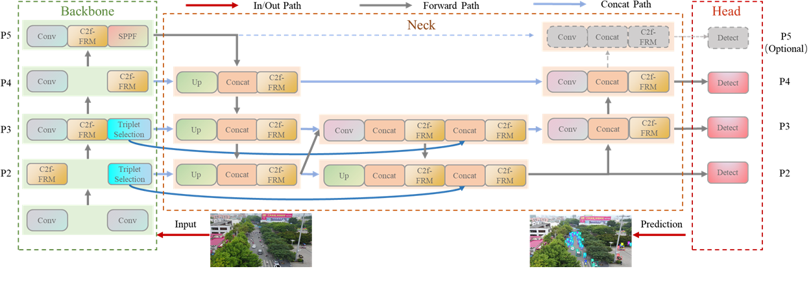

# The implement of FRA-YOLO

## 1. Model architecture 

- Backbone: YOLOv8 with modified C2f-FRM and Triplet Selection
- Neck: Dense Aggregation Network
- Head: p2, p3, p4, p5 (optional)


## 2. Training log
````
The training logs are available at [swanlab.cn](https://swanlab.cn/@pnaclcu/experimental_results/overview). 

You can
 
1. copy the link above and paste it into your browser;
2. click the badge below

to view the training log.

````
CLICK HERE [](https://swanlab.cn/@pnaclcu/experimental_results/overview)

## 3. Pretrained models
### 3.1 Accessable links
```
You can download the pretrained models from 
1.[Google Drive]
2.[Baidu Yun]

```
### 3.2 Put the downloaded .pt files into `./ckpts` and run 
``
python batch_eval.py 
``

See details in `./ckpts/README.md` file.
````
**Architectural details** 
- ./ckpts/
  - Visdrone_dataset
     - m/s/n
      - weights/best.pt
  - CARPK_dataset
  - UAVVaste_dataset
````


## 4. Usage for training FRA-YOLO youselves
### 4.1 Modify the ```dataset.yaml``` and run 
``
python train.py
``
### 4.2 Modify the ``dataset.yaml`` and corresponding `best.pt`, run 
``
python eval.py
``

### 4.3 Quick Start
The .pt files in `./runs/detect/train2` were trained using my personal RTX 2080Ti GPU to ensure the reproducibility of this repo. However, the map@50 is better compared with the reported results in our manuscript.
You can just run eval.py to get the map@50.

``
python eval.py
``

## 5 Acknowledgment
This repo is built upon [ultralytics](https://github.com/ultralytics/ultralytics). 
We do appreciate the authors for their great works.


