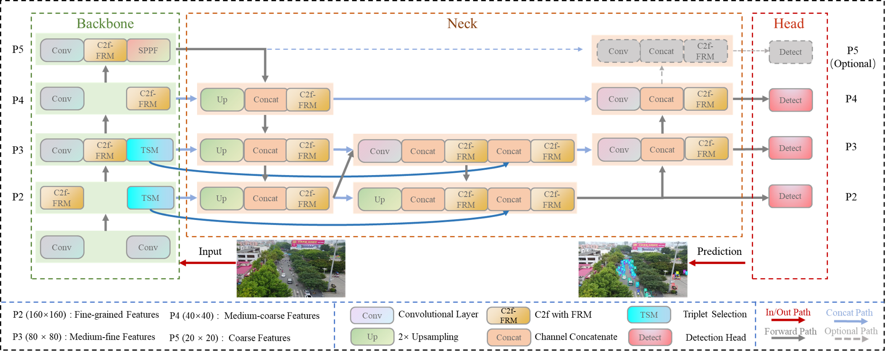
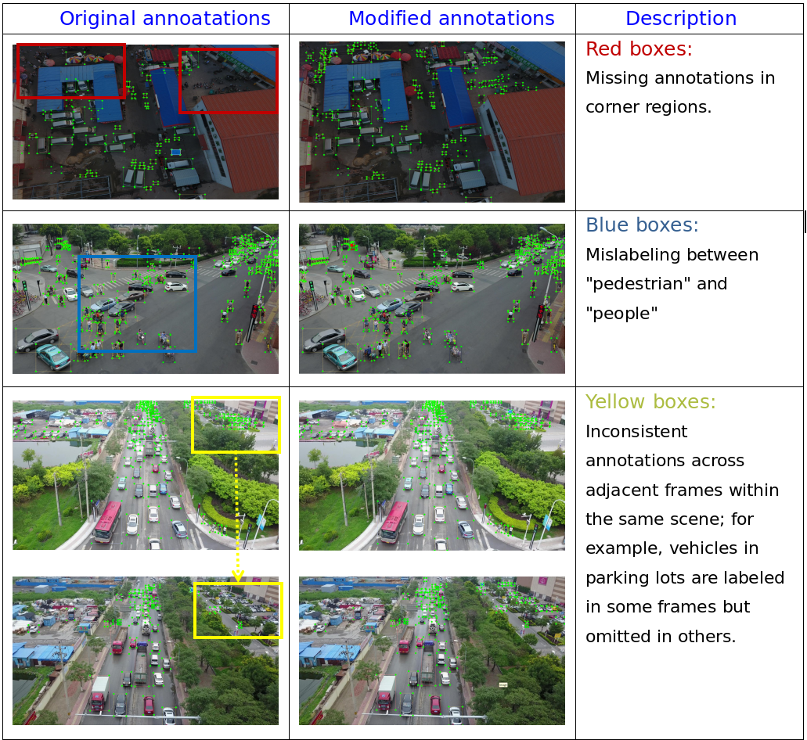

# The implement of FRA-YOLO

## 1. Model architecture 

- Backbone: YOLOv8 with modified C2f-FRM and Triplet Selection
- Neck: Dense Aggregation Network
- Head: p2, p3, p4, p5 (optional)


## 2. Training log
````
The training logs are available at [swanlab.cn](https://swanlab.cn/@pnaclcu/experimental_results/overview). 

You can
 
1. copy the link above and paste it into your browser;
2. click the badge below

to view the training log.

Please note that the corresponding name for each model in log files was not modified, where the yolov8 denotes the proposed FRA-YOLO.

````
CLICK HERE [](https://swanlab.cn/@pnaclcu/experimental_results/overview)

## 3. Pretrained models
### 3.1 Accessable links
```
You can download the pretrained models from 
1.[Google Drive] https://drive.google.com/drive/folders/19a7frGDU1pSsKYAeixKhDeYRCaBhXSiS?usp=sharing
2.[Baidu Yun]    https://pan.baidu.com/s/1PctOf1t-BrcppLnoTBPDFg?pwd=fra1 password: fra1

```
### 3.2 Put the downloaded .pt files into `./ckpts` and run 
``
python batch_eval.py 
``

See details in `./ckpts/README.md` file.
````
**Architectural details** 
- ./ckpts/
  - Visdrone_dataset
     - m/s/n
      - weights/best.pt
  - CARPK_dataset
  - UAVVaste_dataset
````


## 4. Usage for training FRA-YOLO yourselves
### 4.1 Training stage: Modify the ```dataset.yaml``` and run 
``
python train.py
``
### 4.2 Validation stage: Modify the ``dataset.yaml`` and corresponding `best.pt`, run 
``
python eval.py
``

### 4.3 Quick Start
The .pt files in `./runs/detect/train2` were trained using my personal RTX 2080Ti GPU to ensure the reproducibility of this repo. However, the mAP@50 is better compared with the reported results in our manuscript.
You can just run eval.py to get the map@50. See details in `./runs/detect/train2/*` files for details.

``
python eval.py
``

### 4.4 Modified training dataset of VisDrone2019-DET

We conducted a manual review and corrected over 10,000 instances within the VisDrone training set.
We categorized and rectified four primary types of annotation errors:

1. **Missed Annotations (Red Boxes):** Small objects or instances located in the corners of images were frequently ignored by the original annotators.
2. **False Annotations (Blue Boxes):** Category misclassifications were common. For instance, VisDrone strictly distinguishes "pedestrians" (standing/walking) from "people" (other postures, e.g., riders), yet many "people" were erroneously labeled as "pedestrians."
3. **Inconsistent Annotations (Yellow Boxes):** Annotations lacked spatial and temporal consistency. For example, in consecutive frames or similar viewpoints, distant vehicles in a parking lot were annotated while closer, more prominent vehicles were omitted.
4. **Ambiguous Annotation Criteria:** Distant cars (especially SUVs) were often misclassified as "van" due to width-height imbalanced compression in oblique views. We thoroughly investigated the visual characteristics of these edge cases and established unified criteria to re-label them.

<div align="center">
  
  <p>Modified Annotation</p>
</div>

Please note that the cleaned training set was specifically utilized in the Discussion section:

1. **We did not modify the validation and test sets of VisDrone2019-DET** to ensure a strictly fair comparison with SOTA methods
2. **In all comprative experiments, All MODELS were trained using the original, unmodified training annotations** and evaluated on the same test set. 

The new annotations of VisDrone2019-DET will be available after the paper is accepted.

## 5 Acknowledgment
This repo is built upon [ultralytics](https://github.com/ultralytics/ultralytics). 
We do appreciate the authors for their great works.


